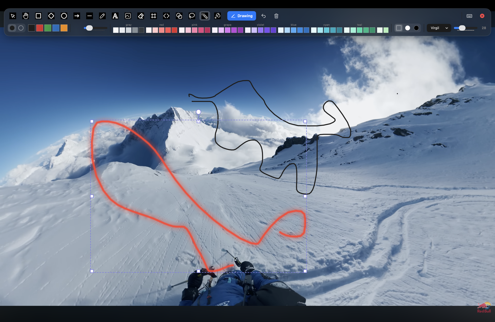
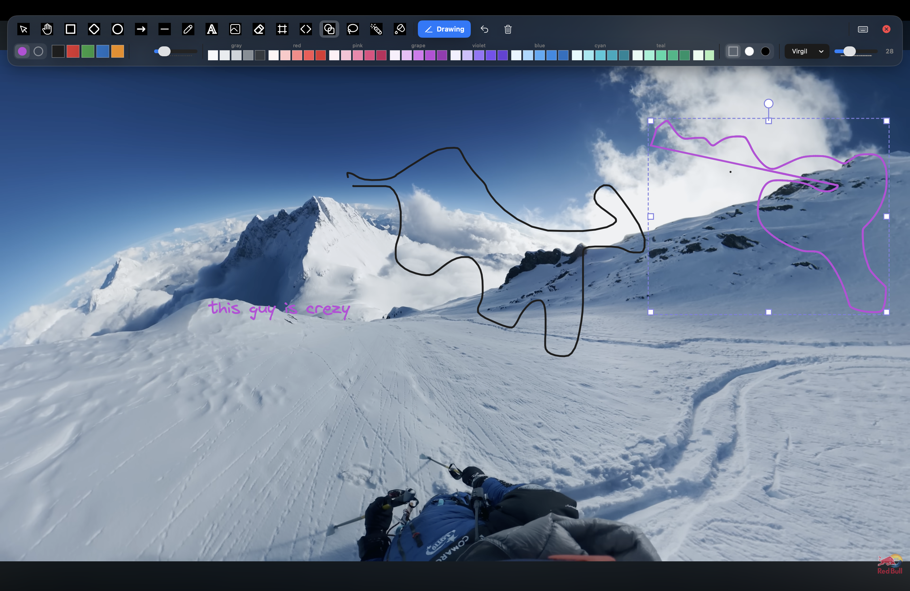
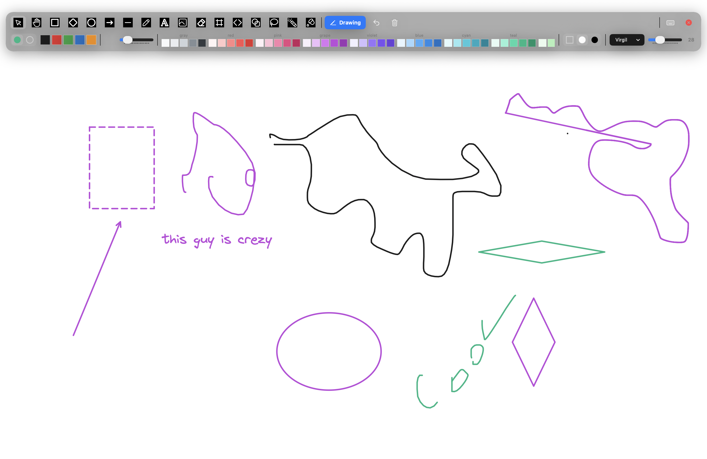

# macdraw

Draw, annotate and laser-point directly on your screen — over any app, in seconds. A lightweight macOS overlay app written in Swift + AppKit.

   

## Demo







## What it does

macdraw is a full-screen transparent overlay that captures your clicks so you can write on top of whatever is on screen — presentations, videos, code, anything.

- **17 drawing tools** — rectangle, diamond, ellipse, arrow, line, freehand sketch, magic shape, frame, text, image, eraser, lasso, laser, fill and more
- **Glowing laser pointer** — neon glow that fades tail-first, leaves no marks
- **White / black screen** — flip the whole display to a clean writing surface
- **Full color palette** — stroke & fill colors, stroke width, dashed strokes
- **Real text** — type anywhere, pick a font family and size, re-edit anytime
- **Images & emoji** — drop pictures, or press `/` for a quick emoji palette
- **Selection editing** — move, resize, rotate, lasso-select, delete, undo
- **Autosave** — your drawing persists across quits and relaunches
- **Keyboard-first** — every tool has a one-key shortcut

## AI text-to-diagram

Open the sparkle button and choose a provider. API keys are stored in the macOS
Keychain separately for each provider. Supported providers are OpenAI/Codex,
Anthropic, OpenRouter, Google Gemini, and OpenAI-compatible endpoints.

Google Gemini uses the native Gemini API; create a key in [Google AI Studio](https://aistudio.google.com/app/apikey), choose **Google Gemini**, and paste it into the Gemini key field. For local diagrams, choose **Local (Ollama)** and use the setup button—macdraw finds an existing Ollama installation, starts its local server when needed, and downloads the selected model.

## Install

### Via the website

Download the DMG or zip from [the macdraw site](https://github.com/aadityakumarsah/macdraw-site) and drag to Applications. First launch: right-click → Open → Open (Gatekeeper is cautious about free unsigned apps).

### Build from source

```bash
git clone https://github.com/aadityakumarsah/macdraw.git
cd macdraw
bash scripts/make_signing_identity.sh   # one-time: creates the self-signed signing cert
bash build.sh           # builds build/macdraw.app
bash dist.sh            # signs it + packages DMG & zip into dist/
open build/macdraw.app
```
